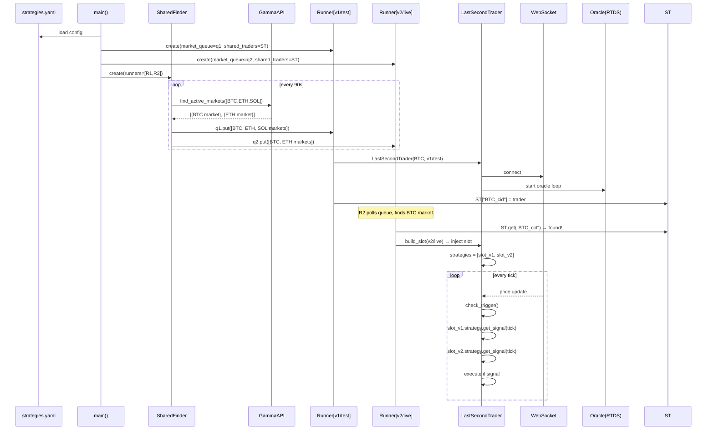
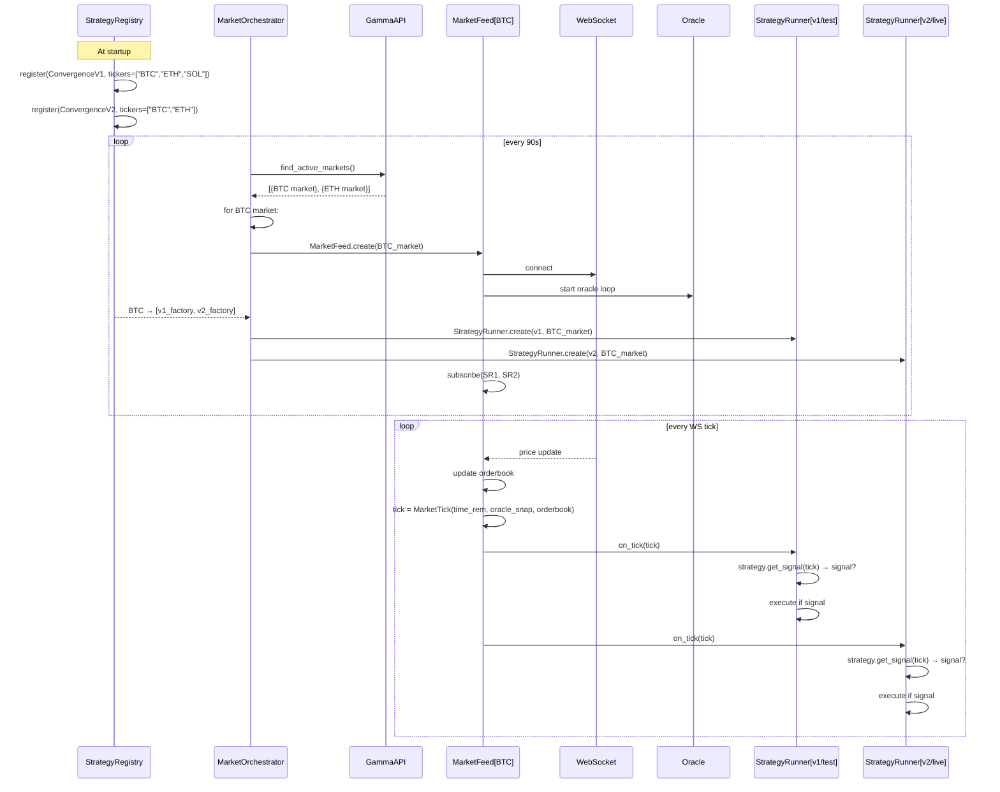
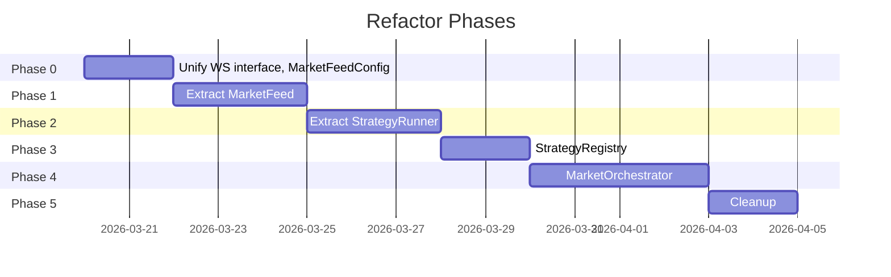

# Architecture Refactor Plan: Strategy-Subscribes-to-Market Model

> **Date:** 2026-03-18
> **Status:** Planning
> **Goal:** Replace the "runner injects slot" model with a clean pub/sub model where strategies subscribe to market feeds.

---

## Table of Contents

1. [Current Architecture](#1-current-architecture)
2. [Problems with Current Architecture](#2-problems-with-current-architecture)
3. [Target Architecture](#3-target-architecture)
4. [Migration Plan (Phases)](#4-migration-plan-phases)
5. [Effort Estimates](#5-effort-estimates)
6. [Invariants to Preserve](#6-invariants-to-preserve)

---

## 1. Current Architecture

### 1.1 Component Map

```
config/strategies.yaml
       │
       ▼
main.py::load_strategies_config()
       │
       ├─► StrategyConfig × N  (one per yaml entry)
       │
       ├─► shared_traders: dict  (condition_id → LastSecondTrader)
       │
       ├─► TradingBotRunner × N  (one per StrategyConfig)
       │         │
       │         ├─ market_queue: asyncio.Queue
       │         ├─ monitored_markets: set
       │         ├─ monitored_tickers: set
       │         ├─ active_traders: dict[condition_id → Task]
       │         ├─ _filter_strategy (strategy instance, market_filter only)
       │         └─ poll_and_trade()
       │
       └─► SharedFinder
                 │
                 └─ polls GammaAPI → dispatches batches to runners' queues
```

### 1.2 Data Flow



### 1.3 Key Classes

| Class | Location | LOC | Responsibility |
|---|---|---|---|
| `StrategyConfig` | main.py:46 | 15 | YAML entry dataclass |
| `TradingBotRunner` | main.py:103 | ~530 | Market discovery + trader lifecycle per strategy |
| `SharedFinder` | main.py:710 | ~95 | Single API poller, dispatches to runner queues |
| `LastSecondTrader` | hft_trader.py:113 | ~1680 | **Everything**: WS, oracle, orderbook, OEM, position, stop-loss, risk, strategy execution |
| `StrategySlot` | hft_trader.py:94 | 15 | Per-strategy context inside a trader |
| `BaseStrategy` | strategies/base.py:51 | 42 | Strategy ABC |
| `ConvergenceV1/V2` | strategies/ | ~430 | Concrete strategies |

---

## 2. Problems with Current Architecture

### 2.1 `LastSecondTrader` — God Object (1794 lines)

The trader class violates Single Responsibility. It owns:
- WebSocket connection (`WebSocketClient` + `OrderbookWS`)
- L1/L2 orderbook (`OrderBook`, `OrderbookTracker`)
- Oracle streaming (`OracleGuardManager`, `_oracle_price_loop`)
- Position management (`PositionManager`, `StopLossManager`)
- Risk management (`RiskManager`)
- Order execution (`OrderExecutionManager`)
- Strategy execution (`check_trigger`, iterating `StrategySlot` list)
- Crash recovery (`position_manager.restore()`)
- Market close recording
- Event replay recording

**Consequence:** Any change touches everything. Tests are near-impossible without mocking 10+ dependencies.

### 2.2 Slot Injection Race Condition

```
Runner1: creates trader → registers in shared_traders → awaits trader.run()
Runner2: receives same market from queue → checks shared_traders ...
         ├─ RACE: if Runner2 checks BEFORE Runner1 registers → takes "normal path"
         │         → opens second WebSocket for same market ❌
         └─ RACE: if Runner2 checks AFTER → injects slot ✓ (correct path)
```

The race is "usually" won because Runner1's coroutine runs synchronously to `self._shared_traders[condition_id] = trader` before the first `await`, but this is fragile and relies on asyncio scheduling order.

### 2.3 Polling Wait Loop Anti-Pattern

After injecting a slot, Runner2 polls in a busy-wait:

```python
# main.py:304
while condition_id in self._shared_traders:
    await asyncio.sleep(1.0)
```

This is not reactive — it's sleeping in a loop waiting for Runner1 to finish. With 100 strategies, this creates 100 sleep loops per market.

### 2.4 Duplicate Strategy Instances Per Market

For each market, TradingBotRunner creates `_filter_strategy` (for `market_filter()` only), and then `LastSecondTrader` creates another strategy instance for actual execution. Two instances per strategy per market.

### 2.5 Strategy Universe Lives in Two Places

A strategy's universe is declared in:
1. `config/strategies.yaml` — `universe: [BTC, ETH, SOL]` (for SharedFinder API filter)
2. `strategies/convergence_v1.py` — `UNIVERSE = ["BTC", "ETH", "SOL"]` (for `market_filter()`)

These can drift. Currently they happen to match, but there is no enforcement.

### 2.6 Scaling Wall at ~10 Strategies

With N strategies:
- N TradingBotRunners each consuming their own queue
- N×M potential slot-injection attempts (N runners × M markets)
- N sleeping loops per active market
- SharedFinder dispatches the same market data N times (once per runner queue)

At 100 strategies × 3 concurrent markets = 300 sleep loops. More critically, the slot-injection logic becomes O(N²) in coordination complexity.

### 2.7 `check_trigger()` Legacy Path

```python
# hft_trader.py:946
# Backward compat: also handle legacy (no-slot) path.
if not self.strategies:
    ...
    self.order_execution.mark_executed()
```

Dead code that will never run in the current config (oracle is always enabled), but persists as maintenance burden and confusion.

### 2.8 OrderbookWS Adapter Indirection

```
LastSecondTrader
  ├─ WebSocketClient (L1, default)
  └─ OrderbookWSAdapter → wraps → OrderbookWS (L2, optional)
```

Two completely different WS implementations with an adapter layer suggests the abstraction was added ad-hoc. There is no clean interface that both implement.

### 2.9 Bugs Caused by This Architecture

| Bug | Root Cause | Fix Commit |
|---|---|---|
| Duplicate traders for same ticker | `monitored_tickers` only tracked in-memory, reset on restart | `a9b8753` |
| Double buy record in live mode | OEM records trade, then dry_run_sim.record_buy() also ran in live path | `6e518a0` |
| `monitored_tickers` preloaded on restart → blocked all trading | Restart logic preloaded ticker locks that prevented new traders | `7db826e` |
| Market close dups, SQL case bug, event loop blocking | Shared mutable state across runners | `6e518a0` + `f7fe381` |

---

## 3. Target Architecture

### 3.1 Design Principles

1. **One MarketFeed per market** — owns WS, orderbook, oracle; emits `MarketTick` to subscribers
2. **Strategies subscribe to tickers** — `ConvergenceV2` says "I want BTC, ETH"; orchestrator wires it up
3. **StrategyRunner is stateless w.r.t. market infrastructure** — only owns strategy instance + OEM + sim
4. **No polling loops** — pure event-driven: ticks push into runners via `asyncio.Queue` or callbacks
5. **Single source of truth for universe** — strategy code declares tickers; YAML only overrides runtime params

### 3.2 New Component Map

```
config/strategies.yaml
       │  (runtime params: mode, size, max_concurrent)
       ▼
StrategyRegistry
  ├─ register(StrategyRunner factory, tickers=["BTC","ETH"])
  └─ lookup(ticker) → [StrategyRunner factories]

MarketOrchestrator
  ├─ polls GammaAPI (once per interval)
  ├─ for each market:
  │    ├─ creates MarketFeed (if not exists for condition_id)
  │    └─ for each StrategyRunner interested in ticker:
  │         └─ creates StrategyRunner → subscribes to MarketFeed
  └─ manages lifecycle (shutdown, timeouts)

MarketFeed  (one per active market)
  ├─ WebSocketClient or OrderbookWS (unified interface)
  ├─ OracleGuardManager
  ├─ OrderBook / OrderbookTracker
  ├─ subscribers: list[StrategyRunner]
  └─ _tick_loop() → for each WS update:
       tick = MarketTick(...)
       for runner in subscribers:
           await runner.on_tick(tick)

StrategyRunner  (one per strategy × market)
  ├─ strategy_instance: BaseStrategy
  ├─ order_execution: OrderExecutionManager
  ├─ dry_run_sim: DryRunSimulator | None
  ├─ position_manager: PositionManager
  └─ on_tick(tick: MarketTick) → evaluate signal → execute
```

### 3.3 Target Data Flow



### 3.4 Class Interfaces

```python
# src/market_feed.py
class MarketFeed:
    """Owns WS, orderbook, oracle for ONE market. Emits ticks to subscribers."""

    def __init__(self, market: MarketInfo, config: MarketFeedConfig): ...

    def subscribe(self, runner: "StrategyRunner") -> None:
        """Add a strategy runner to receive ticks from this feed."""

    def unsubscribe(self, runner: "StrategyRunner") -> None: ...

    async def run(self) -> None:
        """Connect WS + oracle, start tick loop until market close."""

    async def shutdown(self) -> None: ...

    @property
    def oracle_snapshot(self) -> OracleSnapshot | None: ...

    @property
    def orderbook(self) -> OrderBook: ...
```

```python
# src/strategy_runner.py
class StrategyRunner:
    """Lightweight wrapper: one strategy instance + execution context for one market."""

    def __init__(
        self,
        market: MarketInfo,
        strategy: BaseStrategy,
        order_execution: OrderExecutionManager,
        dry_run_sim: DryRunSimulator | None,
        position_manager: PositionManager,
        stop_loss_manager: StopLossManager,
        risk_manager: RiskManager,
    ): ...

    async def on_tick(self, tick: MarketTick) -> None:
        """Called by MarketFeed on every WS update. Evaluate + execute."""

    async def shutdown(self) -> None: ...
```

```python
# src/strategy_registry.py
@dataclass
class StrategyRegistration:
    name: str
    version: str
    mode: str           # "test" | "live"
    size: float
    tickers: list[str]  # from strategy.market_filter() or config override
    factory: Callable[[MarketInfo, TradeDatabase], StrategyRunner]

class StrategyRegistry:
    def register(self, reg: StrategyRegistration) -> None: ...
    def runners_for(self, ticker: str) -> list[StrategyRegistration]: ...
    def all_tickers(self) -> list[str]: ...  # union, for API filter
```

```python
# src/market_orchestrator.py
class MarketOrchestrator:
    """Replaces SharedFinder + TradingBotRunner. Single orchestration point."""

    def __init__(
        self,
        registry: StrategyRegistry,
        poll_interval: int,
        max_concurrent: int,
        shutdown_event: asyncio.Event,
    ): ...

    async def run(self) -> None:
        """Poll → create feeds → wire runners → manage lifecycle."""
```

### 3.5 Target Architecture Diagram

```mermaid
graph TB
    subgraph Config["config/strategies.yaml"]
        YAML[("strategies:\n  - convergence/v1/test\n  - convergence/v2/live")]
    end

    subgraph Registry["StrategyRegistry"]
        REG[register(v1, tickers=[BTC,ETH,SOL])\nregister(v2, tickers=[BTC,ETH])]
    end

    subgraph Orchestrator["MarketOrchestrator"]
        POLL[Poll GammaAPI]
        WIRE[Wire: ticker→runners]
    end

    subgraph Feeds["MarketFeed (one per active market)"]
        F_BTC["MarketFeed[BTC]\n─────────────\nWebSocket\nOracleGuard\nOrderBook"]
        F_ETH["MarketFeed[ETH]\n─────────────\nWebSocket\nOracleGuard\nOrderBook"]
    end

    subgraph Runners["StrategyRunners"]
        SR1["StrategyRunner\nConvergenceV1/test\nOEM + DryRunSim"]
        SR2["StrategyRunner\nConvergenceV2/live\nOEM + TradeDB"]
        SR3["StrategyRunner\nConvergenceV1/test\nOEM + DryRunSim"]
        SR4["StrategyRunner\nConvergenceV2/live\nOEM + TradeDB"]
    end

    YAML --> Registry
    Registry --> Orchestrator
    POLL -->|"find BTC market"| F_BTC
    POLL -->|"find ETH market"| F_ETH
    WIRE --> SR1
    WIRE --> SR2
    WIRE --> SR3
    WIRE --> SR4

    F_BTC -->|"on_tick(tick)"| SR1
    F_BTC -->|"on_tick(tick)"| SR2
    F_ETH -->|"on_tick(tick)"| SR3
    F_ETH -->|"on_tick(tick)"| SR4
```

---

## 4. Migration Plan (Phases)

Each phase is a self-contained commit/PR with a clear rollback point. No behavior changes until Phase 3.

---

### Phase 0 — Extract `MarketFeedConfig` + Unify WS Interface

**Goal:** Preparatory refactoring, zero behavior change.
**Branch:** `refactor/phase0-ws-interface`

#### What changes

1. **Create `src/trading/market_ws.py`** — abstract base `MarketWebSocket`:
   ```python
   class MarketWebSocket(ABC):
       @abstractmethod
       async def connect(self) -> None: ...
       @abstractmethod
       async def disconnect(self) -> None: ...
       @abstractmethod
       def set_on_update(self, cb: Callable) -> None: ...
   ```
2. **Wrap `WebSocketClient`** as `ClobMarketWS(MarketWebSocket)`
3. **Wrap `OrderbookWS`** as `Level2MarketWS(MarketWebSocket)` (moves `OrderbookWSAdapter` logic in)
4. **Create `src/trading/market_feed_config.py`** — `MarketFeedConfig` dataclass:
   ```python
   @dataclass
   class MarketFeedConfig:
       oracle_enabled: bool = True
       oracle_guard_enabled: bool = True
       oracle_min_points: int = 4
       oracle_window_s: float = 60.0
       use_level2_ws: bool = False
       book_log_every_s: float = 1.0
       book_log_every_s_final: float = 0.5
   ```
5. **Pass `MarketFeedConfig`** through `TradingBotRunner → LastSecondTrader` instead of 8 individual kwargs.

#### Files touched
- `src/trading/market_ws.py` (new)
- `src/trading/market_feed_config.py` (new)
- `src/trading/websocket_client.py` (add `MarketWebSocket` base)
- `src/trading/orderbook_ws.py` (add `MarketWebSocket` base)
- `src/trading/orderbook_ws_adapter.py` (fold into `Level2MarketWS`, deprecate adapter)
- `src/hft_trader.py` (use `MarketFeedConfig`, use unified WS interface)
- `main.py` (pass `MarketFeedConfig` instead of individual params)

#### Backward compatibility
100% — same behavior, just reorganized.

#### Testing
- All existing tests pass unchanged
- Manually verify WS connects and market data flows

---

### Phase 1 — Extract `MarketFeed`

**Goal:** Pull WS + oracle + orderbook OUT of `LastSecondTrader` into a new `MarketFeed` class.
**Branch:** `refactor/phase1-market-feed`

#### What changes

1. **Create `src/market_feed.py`**:
   ```
   MarketFeed
   ├─ _ws: MarketWebSocket
   ├─ _oracle_guard: OracleGuardManager
   ├─ orderbook: OrderBook
   ├─ _ob_tracker: OrderbookTracker
   ├─ _subscribers: list[Callable[[MarketTick], Coroutine]]
   ├─ subscribe(cb) / unsubscribe(cb)
   ├─ run() — connect WS + oracle, emit ticks
   └─ shutdown()
   ```
2. **`LastSecondTrader` becomes a `MarketFeed` consumer**:
   - Remove: `_ws_client`, `oracle_guard`, `orderbook`, `_ob_tracker`, `_oracle_price_loop`, `process_market_update`
   - Add: `feed: MarketFeed` (injected)
   - Subscribe `self._on_tick` to the feed
3. **`TradingBotRunner.start_trader_for_market()`** now:
   ```python
   feed = MarketFeed(market, feed_config)
   trader = LastSecondTrader(feed=feed, ...)
   await asyncio.gather(feed.run(), trader.run())
   ```
4. **`_shared_traders`** now maps `condition_id → MarketFeed` (the feed is the shared resource, not the trader).

#### Files touched
- `src/market_feed.py` (new, ~200 lines)
- `src/hft_trader.py` (remove WS/oracle code, inject `MarketFeed`, ~400 lines removed)
- `main.py` (create `MarketFeed` in `start_trader_for_market`, update `_shared_traders` semantics)

#### Backward compatibility
Preserved: same external behavior, same DB writes, same signals. The `LastSecondTrader` still exists and manages slots.

#### Testing
- Unit test `MarketFeed` tick emission with mock WS
- Integration: run dry-run cycle, verify DB records appear

---

### Phase 2 — Extract `StrategyRunner`

**Goal:** Pull per-strategy execution context (the `StrategySlot` + its execution methods) out of `LastSecondTrader` into a proper `StrategyRunner` class.
**Branch:** `refactor/phase2-strategy-runner`

#### What changes

1. **Create `src/strategy_runner.py`**:
   ```
   StrategyRunner
   ├─ strategy: BaseStrategy
   ├─ order_execution: OrderExecutionManager
   ├─ dry_run_sim: DryRunSimulator | None
   ├─ position_manager: PositionManager
   ├─ stop_loss_manager: StopLossManager
   ├─ risk_manager: RiskManager
   └─ on_tick(tick: MarketTick) → async
        ├─ check daily limits
        ├─ get_signal()
        ├─ oracle quality check
        └─ execute_order_for()
   ```
2. **Delete `StrategySlot` dataclass** — replaced by `StrategyRunner`.
3. **`LastSecondTrader.check_trigger()`** becomes:
   ```python
   async def _on_tick(self, tick: MarketTick):
       for runner in self._strategy_runners:
           await runner.on_tick(tick)
   ```
4. **`LastSecondTrader`** becomes a thin coordinator:
   - Holds `feed: MarketFeed` and `runners: list[StrategyRunner]`
   - `add_strategy_slot()` → `add_runner(runner: StrategyRunner)`
   - `build_slot()` → `build_runner()` (factory on `StrategyRunner`)
5. **Delete legacy `check_trigger()` no-slot path** (the `if not self.strategies:` branch).

#### Files touched
- `src/strategy_runner.py` (new, ~200 lines)
- `src/hft_trader.py` (delete `StrategySlot`, delete most of `check_trigger()`, ~300 lines removed)
- `main.py` (`build_slot` → `build_runner`)

#### Backward compatibility
Preserved: `add_strategy_slot()` becomes `add_runner()` — only internal callers in `main.py`.

#### Testing
- Unit test `StrategyRunner.on_tick()` with mock strategy + mock OEM
- Dry-run integration: verify skip records, buy records written to DB

---

### Phase 3 — `StrategyRegistry` + Single Universe Source

**Goal:** Strategies declare their own tickers; YAML only has runtime params.
**Branch:** `refactor/phase3-strategy-registry`

#### What changes

1. **Add `tickers()` method to `BaseStrategy`**:
   ```python
   class BaseStrategy(ABC):
       @classmethod
       def tickers(cls) -> list[str]:
           """Tickers this strategy wants. Default: derive from market_filter()."""
           ...
   ```
2. **Implement in concrete strategies**:
   ```python
   # convergence_v1.py
   UNIVERSE = ["BTC", "ETH", "SOL"]

   @classmethod
   def tickers(cls) -> list[str]:
       return cls.UNIVERSE
   ```
3. **Create `src/strategy_registry.py`**:
   ```python
   class StrategyRegistry:
       def register(self, reg: StrategyRegistration) -> None
       def runners_for(self, ticker: str) -> list[StrategyRegistration]
       def all_tickers(self) -> list[str]
   ```
4. **`main()` populates registry from YAML** (YAML no longer has `universe` field — it's in strategy code). Add optional YAML `universe_override` for backward compat.
5. **`SharedFinder`** uses `registry.all_tickers()` instead of union of runner universes.

#### Files touched
- `strategies/base.py` (add `tickers()` classmethod)
- `strategies/convergence_v1.py`, `convergence_v2.py` (implement `tickers()`)
- `src/strategy_registry.py` (new, ~80 lines)
- `main.py` (populate registry, keep `universe` in YAML as optional override)
- `config/strategies.yaml` (add comment that `universe` is optional; defaults to strategy code)

#### Backward compatibility
`universe` in YAML still works as an override. Strategies that don't implement `tickers()` fall back to `market_filter()` scanning (existing behavior).

#### Testing
- Unit test registry lookup
- Verify `SharedFinder` fetches the right tickers after registry change

---

### Phase 4 — `MarketOrchestrator` (replaces `SharedFinder` + `TradingBotRunner`)

**Goal:** Replace the two-class polling architecture with a single `MarketOrchestrator` that uses the registry to wire feeds to runners.
**Branch:** `refactor/phase4-market-orchestrator`

#### What changes

1. **Create `src/market_orchestrator.py`**:
   ```
   MarketOrchestrator
   ├─ registry: StrategyRegistry
   ├─ active_feeds: dict[condition_id, MarketFeed]
   ├─ active_runners: dict[condition_id, list[StrategyRunner]]
   │
   └─ run():
        while not shutdown:
            markets = await api.find_active_markets(registry.all_tickers())
            for market in markets:
                if condition_id not in active_feeds:
                    feed = MarketFeed(market, config)
                    runners = [
                        reg.factory(market, trade_db)
                        for reg in registry.runners_for(market.ticker)
                    ]
                    feed.subscribe_all(runners)
                    active_feeds[condition_id] = feed
                    asyncio.create_task(feed.run())
            await asyncio.sleep(poll_interval)
   ```

2. **Delete `TradingBotRunner`** — its responsibilities are now:
   - Market discovery → `MarketOrchestrator.run()`
   - Trader creation → `MarketFeed` + `StrategyRunner` factories in registry
   - Dedup (condition_id, ticker) → `active_feeds` dict
   - Health/watchdog → stays as standalone services (minor refactor)

3. **Delete `SharedFinder`** — absorbed into `MarketOrchestrator`.

4. **`LastSecondTrader`** is removed entirely or reduced to a thin glue if still needed.

5. **`main()`** simplifies to:
   ```python
   registry = build_registry_from_config(strategy_configs)
   orchestrator = MarketOrchestrator(registry, config, shutdown_event)
   await asyncio.gather(orchestrator.run(), health_server.run(), watchdog.run())
   ```

#### Files touched
- `src/market_orchestrator.py` (new, ~250 lines)
- `main.py` (delete `TradingBotRunner`, `SharedFinder`, simplify `main()` to ~100 lines)
- `src/hft_trader.py` (delete or reduce to ~100 line stub if still needed)

#### Backward compatibility
This is the breaking phase. All behavior is preserved but the code structure changes fundamentally. The DB schema, signal logic, OEM behavior, and strategy interfaces are unchanged.

#### Testing
- End-to-end dry-run: verify trades recorded in DB
- Multiple strategies on same market: verify both runners fire independently
- Restart: verify no duplicate traders

---

### Phase 5 — Cleanup & Polish

**Goal:** Remove all dead code, legacy paths, and simplify.
**Branch:** `refactor/phase5-cleanup`

#### What changes

1. Delete `StrategySlot`, `add_strategy_slot()`, `build_slot()` (replaced by `StrategyRunner`)
2. Delete `_shared_traders` dict from main (no longer needed — `MarketOrchestrator` owns feeds)
3. Delete `OrderbookWSAdapter` (folded into `Level2MarketWS` in Phase 0)
4. Remove legacy `if not self.strategies:` no-op path in check_trigger (done in Phase 2)
5. Move `discover_strategies()` call to startup, not inside `TradingBotRunner.__init__`
6. Normalize `universe` vs `tickers()` — pick one source of truth
7. Add type stubs / Protocol for `MarketWebSocket`
8. Update `config/strategies.yaml` docs

#### Files touched
- `src/hft_trader.py` (delete or archive)
- `main.py` (50→100 lines final)
- `src/trading/orderbook_ws_adapter.py` (delete)
- `config/strategies.yaml` (update comments)

---

### Phase Summary



---

## 5. Effort Estimates

| Phase | New LOC | Deleted LOC | Net Change | Estimated Hours |
|---|---|---|---|---|
| Phase 0 | +150 | -50 | +100 | 4–6h |
| Phase 1 | +200 | -400 | -200 | 6–8h |
| Phase 2 | +200 | -300 | -100 | 6–8h |
| Phase 3 | +80 | -30 | +50 | 3–4h |
| Phase 4 | +250 | -700 | -450 | 8–12h |
| Phase 5 | +0 | -200 | -200 | 2–3h |
| **Total** | **+880** | **-1680** | **-800** | **29–41h** |

**Key milestone:** After Phase 2, `LastSecondTrader` drops from ~1794 to ~300 lines. After Phase 4, `main.py` drops from ~900 to ~150 lines.

---

## 6. Invariants to Preserve

These must NOT change across any phase:

| Invariant | Where Enforced |
|---|---|
| One WebSocket per market (condition_id) | `active_feeds` dict in `MarketOrchestrator` |
| Per-ticker lock (no two concurrent traders for same BTC market) | `active_feeds` keyed by condition_id; ticker dedup in orchestrator |
| Oracle freshness guard blocks trades | `StrategyRunner.on_tick()` calls `oracle_guard.quality_ok_for_convergence()` |
| FOK buy at `MAX_ENTRY_PRICE` (0.99) | `OrderExecutionManager` — unchanged |
| No double-buy: OEM's `is_executed()` flag | `StrategyRunner.on_tick()` checks before executing |
| Dry-run records in SQLite (skip, buy, sell) | `DryRunSimulator` in `StrategyRunner` |
| Live trades in SQLite (buy, sell, PnL) | `OrderExecutionManager` — unchanged |
| Restart dedup: pre-load condition_ids from DB | `MarketOrchestrator` startup calls equivalent of `_preload_monitored_markets` |
| Graceful shutdown: persist open positions | `StrategyRunner.shutdown()` calls `position_manager._persist()` |
| Watchdog alert if no trades in N hours | Standalone `watchdog_loop` — unchanged |

---

## Appendix: File Map Before → After

```
Before                                After
──────────────────────────────────    ──────────────────────────────────────
main.py                               main.py  (~150 lines)
  TradingBotRunner (~530 lines)    →  src/market_orchestrator.py  (new)
  SharedFinder (~95 lines)         →  (absorbed into MarketOrchestrator)

src/hft_trader.py (~1794 lines)    →  src/market_feed.py  (new, ~200 lines)
  WS + oracle + orderbook          →  src/strategy_runner.py  (new, ~200 lines)
  StrategySlot                     →  (deleted, replaced by StrategyRunner)
  check_trigger()                  →  StrategyRunner.on_tick()
  LastSecondTrader                 →  ~100 line coordinator or deleted

src/trading/orderbook_ws_adapter.py  →  (deleted, folded into market_ws.py)

strategies/base.py                    strategies/base.py  (+ tickers() classmethod)
strategies/convergence_v1.py          strategies/convergence_v1.py  (+ tickers())
strategies/convergence_v2.py          strategies/convergence_v2.py  (+ tickers())

(new)                              →  src/trading/market_ws.py
(new)                              →  src/trading/market_feed_config.py
(new)                              →  src/strategy_registry.py
```
